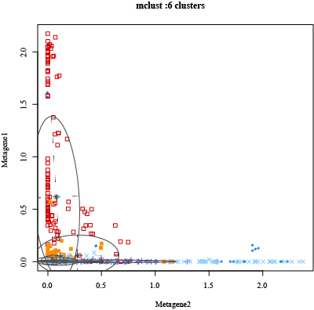
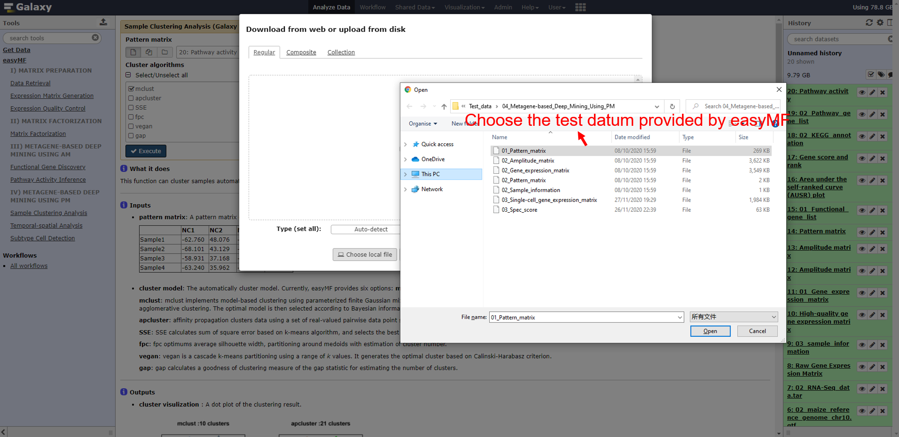
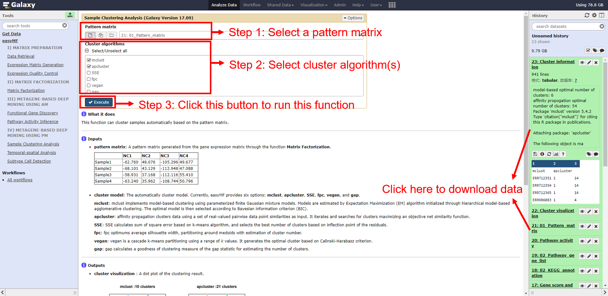
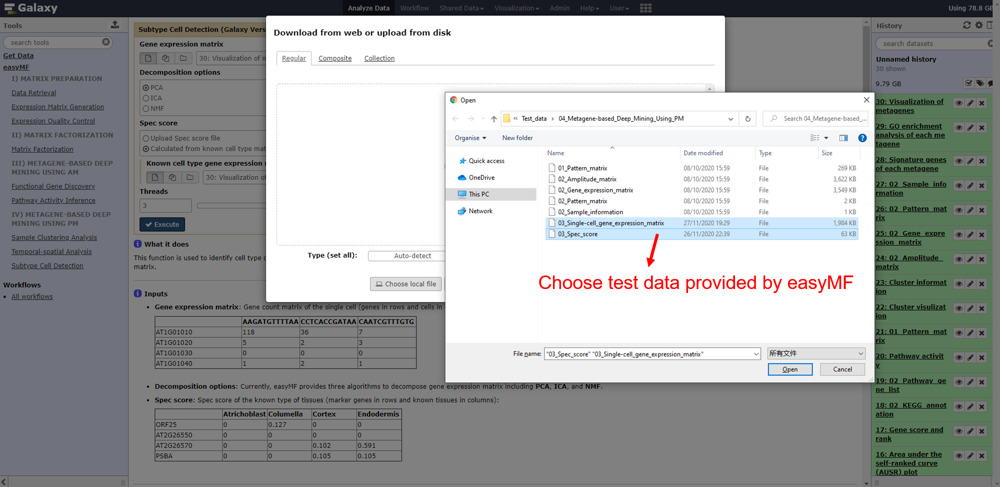

<div align="center"><h1><b>easyMF User Mannual</b></h1></div>

<div align="center">(version 1.0)</div>

easyMF is a user-friendly web platform that aims to facilitate biological discovery from large-scale transcriptome data through matrix factorization (MF). It offers several functional tools for gene expression matrix generation, expression matrix factorization, and metagene-based exploratory analysis including sample clustering, signature gene identification, functional gene discovery, subtype cell detection, and pathway activity inference.

- easyMF project is hosted on https://github.com/cma2015/easyMF.
- easyMF docker image is available in https://hub.docker.com/r/malab/easymf.
- easyMF demo server can be accessed via [http://easyMF.omicstudio.cloud](http://deepea.omicstudio.cloud/).
- The following part shows installation of easyMF docker image and detailed documentation for each function in easyMF.


## 0. Metagene-based Deep Mining Using PM

Pattern matrix (AM), a matrix with samples in rows and metagenes in columns , describes sample-level relationships. In current version of easyMF, users can make use of PM for sample clustering, temporal and spatial transcriptome analysis, and subtype cell detection.

This module consists of three functions: **Sample Clustering Analysis**, **Temporal-spatial Analysis**, and **Subtype Cell Detection**.

  <table class="fl-table">
  <thead>
    <tr>
      <th width="15%">Functions/Tools</th>
      <th width="15%">Description</th>
      <th width="15%">Inputs</th>
      <th width="15%">Outputs</th>
      <th width="15%">Time (test data)</th>
      <th width="15%">Program</th>
      <th width="25%">References</th>
    </tr>
  </thead>
  <tbody>
      <tr>
          <td rowspan="6">Sample Clustering Analysis</td>
          <td rowspan="6">Cluter samples automatically based on the pattern matrix</td>
          <td rowspan="6">Pattern matrix</td>
          <td rowspan="6">Cluster information; Cluster visualization; </td>
          <td rowspan="6">~ 15s</td>
          <td>mclust</td>
          <td><a href="https://www.ncbi.nlm.nih.gov/pmc/articles/pmc5096736/">Scrucca <I>et al</I>., 2016</td>
      </tr>
      <tr>
          <td>apcluster</td>
          <td><a href="https://academic.oup.com/bioinformatics/article-abstract/27/17/2463/224402">Bodenhofer <I>et al</I>., 2011</td>
      </tr>
      <tr>
          <td>SSE</td>
          <td>This study</td>
      </tr>
      <tr>
          <td>fpc</td>
          <td><a href="https://cran.r-project.org/web/packages/fpc/index.html">Hennig, 2013</td>
      </tr>
      <tr>
          <td>vegan</td>
          <td><a href="https://cran.r-project.org/web/packages/vegan/index.html">Dixon, 2003</td>
      </tr>
      <tr>
          <td>gap</td>
          <td><a href="https://cran.r-project.org/web/packages/cluster/cluster.pdf">Maechler <I>et al</I>., 2012</td>
      </tr>
      <tr>
          <td rowspan="3">Temporal-spatial Analysis</td>
          <td rowspan="3">Detect functional modules and identity signature genes </td>
          <td rowspan="3">Gene expression matrix; Amplitude matrix; Pattern matrix; Sample information</td>
          <td rowspan="3">Signature genes of each module; GO enrichment analysis of each module; Visualization of specific module</td>
          <td rowspan="3">~ 5 mins</td>
          <td>In-house scripts</td>
          <td>This study</td>
      </tr>
      <tr>
          <td>cogaps</td>
          <td><a href="https://academic.oup.com/bioinformatics/article/33/12/1892/2975325">Stein-O'Brien <I>et al</I>., 2017</td>
      </tr>
      <tr>
          <td>topGO</td>
          <td><a href="https://bioconductor.org/packages/release/bioc/vignettes/topGO/inst/doc/topGO.pdf">Alexa and Rahnenführer, 2009</td>
      </tr>
      <tr>
          <td rowspan="4">Subtype Cell Detection</td>
          <td rowspan="4">Identity a cell type of unknown single-cell RNA-Seq samples</td>
          <td rowspan="4">Gene expression matrix; Spec score</td>
          <td rowspan="4">Identification results of cell type; Single cell type visulization</td>
          <td rowspan="4">~ 30s</td>
          <td>prcomp</td>
          <td>This study</td>
      </tr>
      <tr>
          <td>ica</td>
          <td><a href="https://cran.r-project.org/web/packages/ica/index.html">Helwig, 2015</td>
      </tr>
      <tr>
          <td>bignmf</td>
          <td><a href="https://rdrr.io/github/panlanfeng/bignmf/man/bignmf.html">Pan <I>et al</I>., 2012</td>
      </tr>
      <tr>
          <td>In-house scripts</td>
          <td>This study</td>
      </tr>   


## 1. Sample Clustering Analysis

In the current version, easyMF provides six optional algorithms ([mclust](https://journal.r-project.org/archive/2016/RJ-2016-021/index.html), [apcluster](https://cran.r-project.org/web/packages/apcluster/index.html), SSE, [fpc](https://cran.r-project.org/web/packages/fpc/index.html), [vegan](https://cran.r-project.org/web/packages/vegan/index.html), and [gap](https://www.rdocumentation.org/packages/cluster/versions/2.1.0/topics/clusGap)) to cluster samples using PM coefficients. The cluster result is visualized in dot plots and tables, providing a quick overview of the relationships among samples.

#### Inputs

- **Pattern matrix**:  A pattern matrix with samples in rows and metagenes in columns. Here is an example:

|          | Metagene 1 | Metagene 2 | ...  | Metagene 4 |
| :------- | :--------- | :--------- | :--- | ---------- |
| Sample 1 | -2.081     | 0.663      | ...  | -0.711     |
| Sample 2 | -2.114     | 0.711      | ...  | -0.757     |
| ...      | ...        | ...        | ...  | ...        |
| Sample 4 | -2.185     | 0.671      | ...  | -0.719     |

- **Cluster algorithms**: easyMF provides six cluster algorithms to be cluster samples including mclust, apcluster, SSE, fpc, vegan, and gap.

  **mclust**: mclust implements model-based clustering using parameterized finite Gaussian mixture models. Models are estimated by Expectation Maximization (EM) algorithm initialized through hierarchical model-based agglomerative clustering. The optimal model is then selected according to Bayesian information criterion (BIC).
  
  **apcluster**: affinity propagation clusters data using a set of real-valued pairwise data point similarities as input. It iterates and searches for clusters maximizing an objective net similarity function.
  
  **SSE**: SSE calculates sum of square error based on k-means algorithm, and selects the best number of clusters based on inflection point of the residuals.
  
  **fpc**: fpc optimums average silhouette width, partitioning around medoids with estimation of cluster number.
  
  **vegan**: vegan is a cascade k-means partitioning using a range of *k* values. It generates the optimal cluster based on Calinski-Harabasz criterion.
  
  **gap**: gap calculates a goodness of clustering measure of the gap statistic for estimating the number of clusters.
  
  ```
  NOTE: easyMF supports multi-selection for different algorithms.
  ```

#### Outputs

- **cluster visulization**:  A dot plot of the clustering results.

​     

- **cluster information**: Sample cluster results for specific algorithms.

|          | mclust | apcluster |
| :------- | :----- | --------- |
| Sample1  | 1      | 18        |
| Sample7  | 7      | 18        |
| Sample11 | 3      | 21        |
| Sample15 | 7      | 14        |

#### How to use this function

- Test datum for this function is `01_Pattern_matrix` in directory `Test_data/04_Metagene-based_Deep_Mining_Using_PM`.

- The following screenshots show us how to cluster samples using easyMF.

  **Step 1**: upload test datum in directory `Test_data/01_Matrix_Preparation` to history panel;

  
  
  **Step 2**: input the corresponding files and appropriate parameters, then run the function.
  
  

#### Running time

This step will cost ~ 15s for the test data.


## 2. Temporal-spatial Analysis

easyMF can be used to determine the extent to which genes change over time in response to perturbations (e.g., developmental time) and identify signature genes dominated at specific compartments with spatial resolution in individual tissue samples (spatial transcriptomes).

#### Inputs

In **Data** section

- **Gene expression matrix**: A gene expression matrix generated by the module **Matrix Preparation**.
- **Amplitude matrix**: An amplitude matrix with genes in rows and metagenes in columns decomposed by the input gene expression matrix .
- **Pattern matrix**: A pattern matrix  with samples in rows and metagenes in columns decomposed by the input gene expression matrix .
- **Sample information**: Sample information containing development stages or spatial compartments.

In **Parameters** section

- **Threshold of Pearson Correlation Coefficient**: A Pearson Correlation Coefficient value used for signature gene identification.
- **Threshold of P-value**: A *P*-value used for signature gene identification.
- **Select a species**: Species name which can be selected from drop-down menu is used to annotate gene information.

#### Outputs

- **Signature genes of each metagene**: Summary of signature genes in each metagene. Columns represent **Metagene ID**, **Gene ID**, and **Gene description**, respectively.

| Metagene ID | Gene ID        | Gene description                    |
| :---------- | :------------- | :---------------------------------- |
| Metagene1   | Zm00001d020505 | DNA glycosylase superfamily protein |
| Metagene2   | Zm00001d012083 | Thioredoxin F-type chloroplastic    |
| Metagene3   | Zm00001d033585 | Leaf permease1                      |

- **GO enrichment analysis of each metagene**: Summary of GO enrichment results of signature genes in each metagene.

| Metagene ID | Type | GO         | Term                      | Annotated | Significant | Expected | elimFisher | Significant gene                                            |
| :---------- | :--- | :--------- | :------------------------ | :-------- | :---------- | :------- | :--------- | :---------------------------------------------------------- |
| Metagene1   | BP   | GO:0042445 | hormone metabolic process | 91        | 6           | 1.65     | 0.00624    | Zm00001d011117;Zm00001d032223;Zm00001d039174;Zm00001d039650 |

- **Visualization of metagenes**: Hierarchical clustering analysis of pattern matrix.

​      

#### How to use this function

- Test data for this function are in directory `Test_data/04_Metagene-based_Deep_Mining_Using_PM` including `02_Gene_expression_matrix`, `02_Amplitude_matrix`, `01_Pattern_matrix`, and `02_Sample_information`.

- The following screenshots show us how to implement temporal-spatial transcriptome analysis using easMF.

  **Step 1**: upload test data in directory `Test_data/04_Metagene-based_Deep_Mining_Using_PM` to history panel;

  

   **Step 2**: input the corresponding files and appropriate parameters, then run the function.       

  

#### Running time

This step will cost ~ 5 mins for the test data.


## 3. Subtype Cell Detection

Single-cell RNA-Seq, which measures gene expressions at the level of a single cell, has been developed as a powerful technique to investigate the function of individual cells. easyMF can be used to identify cell types of unknown cells, which is one of key steps in the process of single-cell transcriptome analysis.

#### Inputs

- **Gene expression matrix**: Gene count matrix of the single cell.

<table class="fl-table">
  <thead>
    <tr>
      <th width="20%"></th>
      <th width="20%">AAGATGTTTTAA</th>
      <th width="20%">CCTCACCGATAA</th>
      <th width="20%">...</th>
      <th width="20%">CAATCGTTTGTG</th>
  </tr>
  </thead>
  <tbody>
      <tr>
          <td>AT1G01010</td>
          <td>118</td>
          <td>36</td>
          <td>...</td>
          <td>7</td>
      </tr>
      <tr>
          <td>AT1G01020</td>
          <td>5</td>
          <td>2</td>
          <td>...</td>
          <td>3</td>
      </tr>
      <tr>
          <td>AT1G01030</td>
          <td>0</td>
          <td>0</td>
          <td>...</td>
          <td>0</td>
      </tr>
      <tr>
          <td>...</td>
          <td>...</td>
          <td>...</td>
          <td>...</td>
          <td>...</td>
      </tr>
      <tr>
          <td>AT1G01040</td>
          <td>1</td>
          <td>2</td>
          <td>...</td>
          <td>1</td>
      </tr>

- **Decomposition options**: Currently, easyMF provides three algorithms to decompose single-cell gene expression matrix including **PCA**, **ICA**, and **NMF**.

- **Spec score**: Spec score of the known type of tissues. Here's an example:

  |           | Atrichoblast | Columella | Cortex | Endodermis |
  | :-------- | :----------- | :-------- | :----- | ---------- |
  | ORF25     | 0            | 0.127     | 0      | 0          |
  | AT2G26550 | 0            | 0         | 0      | 0          |
  | AT2G26570 | 0            | 0         | 0.102  | 0.591      |
  | PSBA      | 0            | 0         | 0.105  | 0.105      |

​       In addition, **Spec score** can also be obtained through a known tissue expression matrix.

#### Outputs

- **t-SNE dimensional reduction of single cells**

- **Cell type detection result**:

<table class="fl-table">
  <thead>
    <tr>
      <th width="20%">Cell_name</th>
      <th width="20%">type</th>
  </tr>
  </thead>
  <tbody>
      <tr>
          <td>AAGATGTTTTAA</td>
          <td>Trichoblast</td>
      </tr>
      <tr>
          <td>CCTCACCGATAA</td>
          <td>Trichoblast</td>
      </tr>
      <tr>
          <td>GCGTTTGCCCTC</td>
          <td>Cortext</td>
      </tr>
      <tr>
          <td>...</td>
          <td>...</td>
      </tr>
      <tr>
          <td>AACCTGGTATTG</td>
          <td>Atrichoblast</td>
      </tr>

#### How to use this function

- Test data for this function are in directory `Test_data/04_Metagene-based_Deep_Mining_Using_PM` including `03_Single-cell_gene_expression_matrix`, and `03_Spec_score`.

- The following screenshots show us how to detect cell type for single-cell RNA-Seq data using easMF.

  **Step 1**: upload test data in directory `Test_data/04_Metagene-based_Deep_Mining_Using_PM` to history panel;

  

   **Step 2**: input the corresponding files and appropriate parameters, then run the function.      

  

#### Running time

This step will cost ~ 30s for the test data.